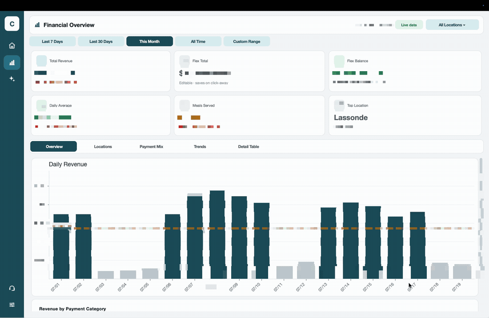
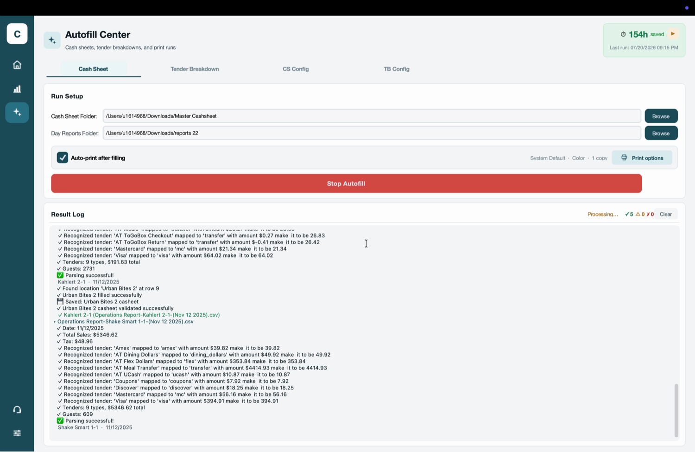
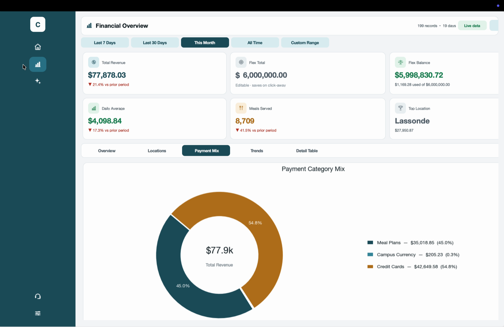
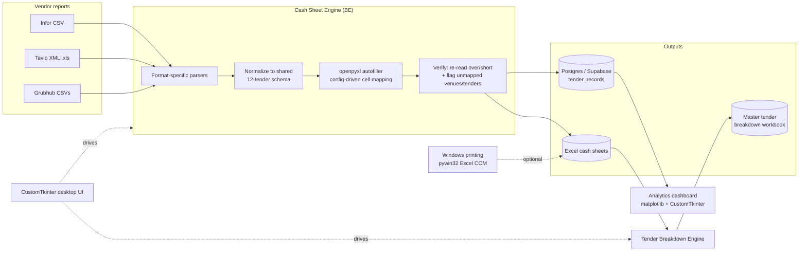
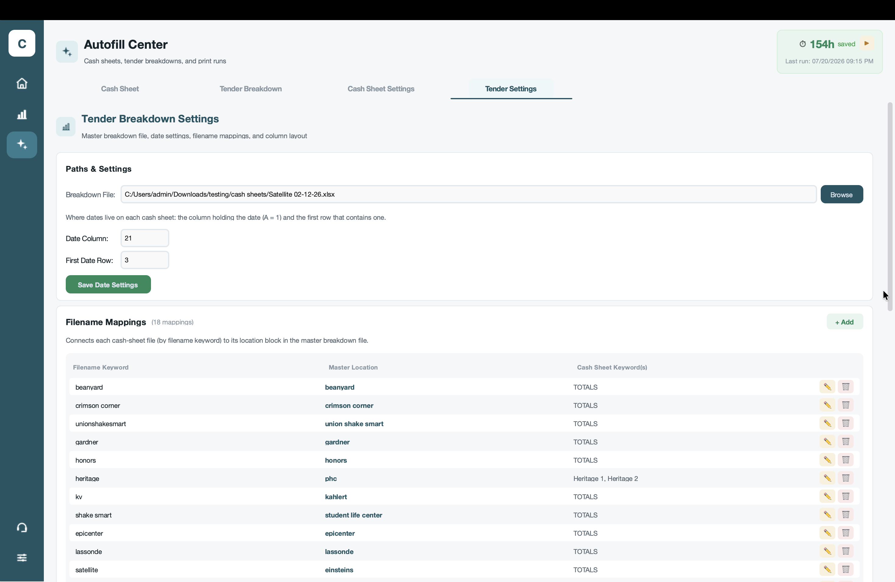

# Chartwells Automation

A Windows desktop app that turns a **50-minute daily reconciliation of ~$77K in sales across 15+ campus dining locations into one click** — parsing three unrelated vendor reporting formats, normalizing them to a shared schema, autofilling the accounting ledgers, verifying the result, and surfacing the numbers on an executive analytics dashboard.

Built for the Chartwells Higher Education dining team at the University of Utah. Non-technical staff run it daily as a packaged `.exe` with zero setup.

> **Impact:** ~30 min/day of manual data entry eliminated per run · 150+ staff hours saved since Nov 2025 · absorbed a data-entry role that was never backfilled.



*Live demo: analytics dashboard → one-click cash-sheet autofill with a streaming validation log → print options. Dollar figures are blurred for confidentiality.*

---

## The problem

Every day, three separate point-of-sale / delivery systems each spit out reports in a **different, incompatible format**:

| Source | Format | Shape |
| --- | --- | --- |
| **Infor** (campus POS) | Section-based plain-text CSV | 1 file = 1 venue, 1 day |
| **Tavlo** (POS) | SpreadsheetML XML (`.xls`) | 1 file = 1 venue, 1 day |
| **Grubhub** (delivery) | Two CSVs (transactions + order counts) | 1 file = *many* venues × *many* days × payment methods |

A staff member used to open each report, read off sales / tax / guest counts / a dozen tender types, and hand-key them into the correct row of the correct weekday tab of the correct location's Excel "cash sheet" — for every venue, every day. Then repeat the whole thing to roll the cash sheets up into a master tender-breakdown workbook. It was slow, and a single mistyped number silently broke reconciliation.

## What the app does

1. **Parses** all three vendor formats and **normalizes** every payment type down to one shared 12-tender vocabulary.
2. **Autofills** each location's Excel cash sheet — the right cell, row, and weekday tab — driven entirely by a JSON config (no code changes to add a venue).
3. **Verifies** each fill by re-reading the workbook's over/short column, and flags any source→ledger mismatch instead of letting it pass silently.
4. **Rolls up** the filled cash sheets into a single master tender-breakdown workbook.
5. **Logs** every record to a Postgres database, which powers a built-in **analytics dashboard** (revenue trends, payment mix, per-location ranking, meals served, flex balances).
6. **Prints** the finished sheets and the Infor / Tavlo reports to a chosen printer (Windows; Grubhub CSVs are autofill-only and never printed), **auto-updates** itself from GitHub Releases, and **tracks hours saved**.

---

## Screenshots

| Autofill Center (live run) | Payment mix |
| --- | --- |
|  |  |

*Left: the reconciliation engine streaming a live result log — each recognized tender, per-venue sales, guest counts, and a per-sheet validation pass. Right: the analytics view reading the same records back from the database.*

---

## Architecture



**Three-layer design:**

- **UI (`UI/`)** — a single-window CustomTkinter app: a hover-expanding sidebar and three pages (Home / Analytics / Auto-Fill Center). The UI never does business logic; it spawns the engines on worker threads and streams their events into a live, color-coded result log.
- **Backend (`BE/src/`)** — the parsers, normalization, Excel autofillers, verification, printing, updater, and DB manager. Every engine is UI-agnostic (takes an `on_event` callback and a cooperative `stop_event`), so it can run headless or under the GUI.
- **Data** — a PostgreSQL database (hosted on Supabase, accessed via `psycopg2`) is the system of record that decouples "filling the sheets" from "reporting on the numbers."

---

## How the pipeline works

**1 · Parse.** Each vendor gets a dedicated parser subclassing a small `BaseParser`. They handle format-specific ugliness — Infor's section markers, Tavlo's sparse SpreadsheetML rows (`ss:Index`), Grubhub's per-venue/per-date nesting and column names that are re-resolved by header at parse time so the parser survives column shifts.

**2 · Normalize.** Every raw tender name ("AT Meal Transfer", "Mastercard", "AT Flex Dollars"…) is mapped through a config table into one of **12 canonical tenders** (`contract_card, flex, transfer, coupons, ucash, ushop, chartwellsDCB, dining_dollars, amex, discover, mc, visa`). Accented location names are Unicode-normalized so `"Café"` matches `"Cafe"`. The output of every parser is the same shape: `location, date, total_sales, tax, count, net_sales, tenders{}`.

**3 · Autofill.** `openpyxl` opens each location's workbook, picks the tab matching the report's weekday, finds the location's row (exact match, then a "contains" fallback so `grubhub` matches inside `City Edge - grubhub`), and writes each value to the column named in the JSON config. **A whole config, not code, defines the mapping** — 21 location routes and 20 Grubhub venue groupings live in [`cash_sheet_config.json`](BE/src/cash_sheet_filler/cash_sheet_config.json), all editable from the in-app **Cash Sheet Settings** tab.

**4 · Verify (the part that matters).** After writing, the engine re-opens the sheet and reads the spreadsheet's own **over/short** column; a non-zero value flags the fill as a validation failure. `openpyxl` writes formulas but never evaluates them, so when that column holds a formula the engine reports the check as *unverified* rather than claiming a pass it didn't earn. Independently of Excel, the trace sums the tender columns against sales in Python — so a mismatch (an unmapped tender leaking into the total, say) surfaces before the workbook is ever opened. Parsers additionally collect any tender or venue they couldn't map and surface them as warnings. This cross-check is what drove several early parser fixes and kept accuracy holding as new venues were added.

**5 · Aggregate.** The Tender Breakdown engine reads the filled cash sheets back (values only, via `data_only=True`) and writes each location's daily figures into the correct date row of a single master workbook — including special cases like summing multi-register venues.

**6 · Persist & report.** Each record is UPSERTed into `tender_records` (`ON CONFLICT (report_date, raw_location, location, source)`), and the analytics page reads aggregates back for KPIs and charts — with period-over-period comparison and a location filter.

**Following the money.** With `"verbose_trace": true` in [`cash_sheet_config.json`](BE/src/cash_sheet_filler/cash_sheet_config.json) (the default), the log shows the arithmetic behind every figure rather than just the totals — each CSV row's charged amount and the service fee subtracted from it, grouped under its venue; how several venues sum into one cash-sheet row; the discount added back to both sales and the `visa` tender; the tenders-vs-sales balance; and the exact cell each number was written to. Set it to `false` for totals-only output.

```
┌ Absurd Bird · 07/28/2025  (3 row(s))
│ Credit Card      charged $   112.75  − fee $   3.25  = $   109.50  → visa             · tax $   8.42 · meals   9
│ Dining Dollars   charged $    55.30                  = $    55.30  → dining_dollars   · tax $   4.10 · meals   5 · discount $2.00 held
│ Meal Swipes      charged $    18.00                  = $    18.00  → transfer         · tax $   1.20 · meals   2 · merged from "- Meal Transfer"
└ venue total: sales $182.80 · tax $13.72 · discounts held $2.00 · meals 16
┌ row 'grubhub' (Gardner Food Court) · 07/28/2025 ← Absurd Bird + Cupbop + Iron Waffle
│ order count : 15 + 6 + 3 = 24
│ sales       : $182.80 + $77.90 + $33.00 = $293.70
│ discounts   : $2.00 added back → visa $187.40 → $189.40, sales $293.70 → $295.70
│ balance     : tenders $295.70 vs sales $295.70  ✓ balances
│ wrote       : U1 date 07/28/2025 · A13 count 24 · C13 sales 295.70 · C14 tax 22.22 · S13 visa 189.40 …
```

---

## Adding venues & tenders yourself — no code needed

Everything the engines rely on is editable from inside the app. The **Cash Sheet Settings** and **Tender Settings** tabs in the Auto-Fill Center expose the whole configuration as tables with **+ Add**, edit, and delete controls:



- **Cash Sheet Locations** — route a new Infor / Tavlo report location: which cash-sheet workbook it belongs to, which register row inside the sheet, and the name shown on the Analytics page.
- **Grubhub Venues** — the same routing for venues that appear on the Grubhub report.
- **Fill Columns / Checking Columns** — change which spreadsheet column each value is written to, and which columns are re-read during verification.
- **Tender maps** — teach the app a new tender name from any vendor report (Infor, Tavlo, or Grubhub) and map it to one of the 12 canonical tenders.
- **Tender Settings** — the master-breakdown side: filename → location mappings, each location's start column, and the date / data-column layout.

Dialogs describe every field with concrete examples, validate numeric input, block duplicate names, and each change is written straight back to the JSON config the engines read — so a non-technical staff member can onboard a brand-new dining venue in under a minute, in the packaged `.exe`, without touching a file.

---

## Tech stack

- **Language:** Python 3.11
- **Desktop UI:** CustomTkinter (Tkinter)
- **Charts:** Matplotlib (embedded via `FigureCanvasTkAgg`, rendered off the main thread)
- **Excel I/O:** openpyxl (read + write, formula-aware verification)
- **Database:** PostgreSQL on Supabase via psycopg2 (parameterized, column-name validated)
- **Windows printing:** pywin32 (Excel COM automation + printer `DevMode` control)
- **Packaging / CI:** PyInstaller + GitHub Actions → signed Windows build published as a GitHub Release
- **Auto-update:** GitHub Releases polling with in-app download + self-replace

---

## Project structure

```
BE/src/
├── cash_sheet_filler/        # Vendor parsers + Excel autofill engine
│   ├── base_parser.py            # shared logging base class
│   ├── infor_parser.py           # Infor section-based CSV
│   ├── tavlo_parser.py           # Tavlo SpreadsheetML XML
│   ├── grubhub_parser.py         # Grubhub transactions (sales/tax/tenders)
│   ├── grubhub_order_count_parser.py  # Grubhub order counts (source of truth for counts)
│   ├── excel_autofiller.py       # openpyxl cell targeting + over/short verification
│   ├── main.py                   # CashSheetAutofillEngine (orchestration)
│   └── cash_sheet_config.json    # location routing, tender maps, cell columns
├── tender_break/             # Cash sheets → master tender-breakdown rollup
├── db/tendersdb_manager.py   # Postgres manager (upsert + analytics aggregates)
├── printer.py                # Windows Excel COM printing
├── updater.py                # GitHub Releases auto-updater (CURRENT_VERSION)
├── time_tracker.py           # "hours saved" metric (time_saved.json)
└── path_helper.py            # frozen (.exe) vs dev path resolution

UI/
├── dashboard.py              # App window, sidebar + swappable pages
└── components/
    ├── sidebar.py            # hover-expand nav
    ├── autofill_center.py    # Autofill Center view (Cash Sheet / Tender / configs)
    ├── autofill_center_runtime.py  # threads, stop events, live log streaming
    ├── analyticsPage.py      # executive dashboard (KPIs + 5 chart tabs)
    ├── taskManager.py        # team task board
    └── theme.py              # single "Deep-Teal" design system
```

---

## Getting started (development)

```bash
# 1. Create + activate a virtual environment
python -m venv .venv
source .venv/bin/activate        # Windows: .venv\Scripts\Activate.ps1

# 2. Install dependencies
pip install -r requirements.txt

# 3. Point the DB at Postgres (analytics + record log)
echo "DATABASE_URL=postgresql://..." > .env

# 4. Run
python UI/dashboard.py
```

> Parsing and autofill run cross-platform; **printing and self-update are Windows-only** (they use pywin32 / self-replacing the `.exe`) and no-op elsewhere.

### Build the Windows executable

```bash
pyinstaller chartwells.spec --clean
# → dist/ChartwellsAutomation/ChartwellsAutomation.exe
```

CI ([`.github/workflows/build.yml`](.github/workflows/build.yml)) builds the same artifact on `windows-latest` and publishes it to a GitHub Release on a `v*.*.*` tag, which the in-app updater then picks up. `CURRENT_VERSION` (currently `1.1.19`) lives in [`updater.py`](BE/src/updater.py).

Config, `.env`, and the hours-saved file are all resolved to an editable `config/` folder next to the `.exe` in frozen mode, so non-technical users can adjust mappings without touching code.

---

## Demo walkthrough

The app opens on the dashboard and follows this path:

1. **Dashboard opens on Analytics** — the *Financial Overview* with KPI cards (Total Revenue, Flex Total/Balance, Daily Average, Meals Served, Top Location) and a Daily Revenue bar chart. Data is live from the database.
2. **Sidebar → Auto-Fill Center** → the **Cash Sheet** tab. The *Cash Sheet Folder* and *Day Reports Folder* are prefilled; the header shows a running **hours-saved** badge.
3. **Run the fillings** — click **Run Cash Sheet Autofill**. The button flips to a red **Stop Autofill**, status goes `Ready → Processing…`, and the **Result Log** streams each recognized tender, per-venue totals, guest counts, and a per-sheet `validated successfully` line, while the ✓ / ⚠ / ✗ badges tick up.
4. **Interrupt it** — click the red **Stop Autofill** button; the run cooperatively stops and the status reads **Cancelled**. *(Optional config beat: open **Print options** and switch the printer / Color → Black-and-white, then **Save** — this changes the next run's print settings; it does not itself stop a run.)*
5. **Sidebar → Analytics** — switching back re-queries the database (`on_show()`), so the charts refresh. Click through the chart tabs — **Overview** (daily revenue bars), **Locations** (ranked bars), **Payment Mix** (donut), **Trends** (current vs. prior period lines), **Detail Table** — and toggle date presets or the **All Locations** filter.

---

## Design decisions worth calling out

- **Config-driven, not hard-coded.** Adding a dining venue is a JSON edit (or a few clicks in the in-app config editor) — the routing, tender vocabulary, and target cells are all data, not code. This is why the pipeline held accuracy as locations were added.
- **Verification is a first-class stage.** The engine treats "the sheet saved" and "the sheet reconciles" as different outcomes. Catching silent source mismatches was the single most valuable feature to the accounting team.
- **UI/engine separation.** Every engine is a plain class with an `on_event` callback and a cooperative `stop_event` — no Tkinter imports — so runs are cancellable, testable, and could be scripted headless.
- **Database as the seam.** Filling ledgers and reporting on them are fully decoupled through Postgres, so the analytics dashboard is just a reader over an idempotent, upserted record log.
```
